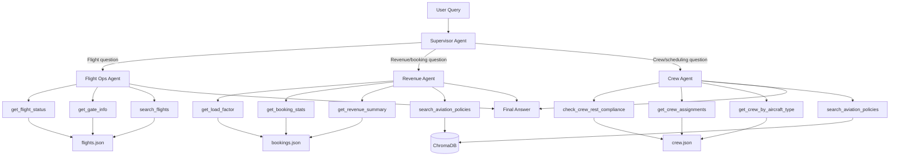
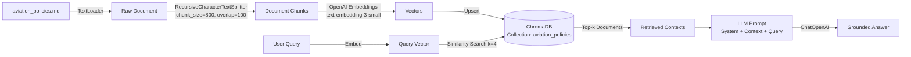

# Aviation Multi-Agent Operations Assistant

A production-grade multi-agent system built with **LangGraph** that powers an airline operations control center. The system routes natural-language queries to specialist AI agents — each equipped with domain-specific tools and access to aviation policy documents via RAG — to deliver accurate, actionable answers for flight ops, revenue management, and crew scheduling.

## Why This Matters

Modern airlines operate in high-stakes, real-time environments where decisions about flight schedules, revenue optimization, and crew compliance must be fast and accurate. This project demonstrates how **agentic AI** can:

- **Automate operational decision support** by routing queries to domain-specialist agents
- **Enforce safety compliance** through tool-calling against structured data (crew rest, fatigue scores)
- **Ground answers in policy** using Retrieval-Augmented Generation over aviation regulations
- **Scale to production** via a stateless FastAPI endpoint backed by a composable LangGraph workflow

This architecture maps directly to enterprise agentic systems deployed on **Azure** (Azure OpenAI, Azure AI Search, Azure Container Apps) with observability, autoscaling, and CI/CD.

## Tech Stack

| Component | Technology | Version |
|-----------|-----------|---------|
| Multi-agent orchestration | LangGraph | >= 0.2.0 |
| LLM integration & tool-calling | LangChain + LangChain-OpenAI | >= 0.3.0 |
| Vector store (RAG) | ChromaDB via LangChain-Chroma | >= 0.5.0 |
| API layer | FastAPI + Uvicorn | >= 0.115.0 |
| Data models | Pydantic v2 | >= 2.10.0 |
| Language | Python | 3.11+ |

## Architecture Overview

The system follows a **supervisor-router pattern**: a lightweight supervisor agent classifies each incoming query and delegates to one of three specialist agents. Each specialist has its own set of tools (backed by simulated JSON data) and, where appropriate, a RAG retriever over aviation policy documents stored in ChromaDB.

### Multi-Agent Routing Flow



### RAG Pipeline Flow



## Project Structure

```
project-1-aviation-multi-agent/
├── README.md                          # This file
├── requirements.txt                   # Python dependencies
├── main.py                            # CLI entry point (interactive + single-query)
├── api.py                             # FastAPI REST endpoint
├── src/
│   ├── __init__.py
│   ├── config.py                      # Environment and path configuration
│   ├── models.py                      # Pydantic models and LangGraph state
│   ├── graph.py                       # LangGraph workflow (StateGraph)
│   ├── agents/
│   │   ├── __init__.py
│   │   ├── supervisor.py              # Query classifier / router
│   │   ├── flight_ops.py              # Flight operations specialist
│   │   ├── revenue.py                 # Revenue management specialist
│   │   └── crew.py                    # Crew management specialist
│   ├── tools/
│   │   ├── __init__.py
│   │   ├── flight_tools.py            # Flight data lookup tools
│   │   ├── booking_tools.py           # Booking/revenue analytics tools
│   │   └── crew_tools.py             # Crew scheduling tools
│   └── rag/
│       ├── __init__.py
│       ├── vectorstore.py             # ChromaDB setup and document ingestion
│       └── retriever.py               # RAG retrieval tool
├── data/
│   ├── flights.json                   # Simulated flight schedule data
│   ├── bookings.json                  # Simulated booking/revenue data
│   ├── crew.json                      # Simulated crew roster data
│   └── docs/
│       └── aviation_policies.md       # Policy documents for RAG ingestion
```

## Setup & Run

### 1. Prerequisites

- Python 3.11+
- An OpenAI-compatible API key (OpenAI, Azure OpenAI, or any compatible provider)

### 2. Install dependencies

```bash
cd project-1-aviation-multi-agent
python -m venv .venv
source .venv/bin/activate   # Windows: .venv\Scripts\activate
pip install -r requirements.txt
```

### 3. Configure environment

Create a `.env` file in the project root:

```env
OPENAI_API_KEY=sk-your-key-here

# Optional: override defaults
# OPENAI_BASE_URL=https://your-azure-endpoint.openai.azure.com/
# LLM_MODEL=gpt-4o
# LLM_TEMPERATURE=0
# EMBEDDING_MODEL=text-embedding-3-small
# API_HOST=0.0.0.0
# API_PORT=8000
```

### 4. Run — CLI mode

Single query:

```bash
python main.py "What is the status of flight VJ101?"
```

Interactive REPL:

```bash
python main.py
```

### 5. Run — API mode

```bash
python api.py
# or
uvicorn api:app --reload
```

Then send a request:

```bash
curl -X POST http://localhost:8000/query \
  -H "Content-Type: application/json" \
  -d '{"query": "Are there any crew rest violations today?"}'
```

## Example Queries & Expected Outputs

### Flight Operations

**Query:** `"What is the status of flight VJ203?"`

**Expected:** The system routes to the flight_ops agent, which calls `get_flight_status("VJ203")` and returns:
> Flight VJ203 (VietJet Air) from SGN to CXR is currently **DELAYED** by 45 minutes due to weather. It is assigned to Gate A05, Terminal T1. Original departure was 11:15, now expected around 12:00.

### Revenue Management

**Query:** `"What is the load factor for VN302 and does it meet our targets?"`

**Expected:** The system routes to the revenue agent, which calls `get_load_factor("VN302")` and `search_aviation_policies("load factor targets trunk routes")`, then responds:
> VN302 (HAN-DAD) has a load factor of **94.1%** with 287 of 305 seats booked. This exceeds the trunk route target of 88-95% per policy. Business class has 8 seats remaining at an average fare of $520.

### Crew Management

**Query:** `"Are there any crew rest violations?"`

**Expected:** The system routes to the crew agent, which calls `check_crew_rest_compliance()` and returns:
> There are **2 rest violations** out of 8 crew members:
> - **FO-003** (Le Hoang Nam): Only 9.0h rest vs. 10h required (1.0h deficit). Fatigue risk: 0.72 (HIGH). Assigned to VJ203 — must be replaced.
> - **FA-007** (Dang Thi Mai): Only 5.0h rest vs. 10h required (5.0h deficit). Fatigue risk: 0.85 (CRITICAL). Assigned to VJ101 — must be replaced immediately.

### Cross-Domain (Policy RAG)

**Query:** `"What is our overbooking policy for international flights?"`

**Expected:** Routes to the revenue agent, which uses `search_aviation_policies` to retrieve the overbooking policy and responds with specific limits (3% for long-haul, 5% for short-haul) and compensation rules.

## Production Deployment Considerations

This project is designed with a clear path to production on **Azure**:

| Local Component | Azure Production Equivalent |
|----------------|---------------------------|
| OpenAI API | **Azure OpenAI Service** (GPT-4o, embeddings) |
| ChromaDB | **Azure AI Search** (vector index) |
| FastAPI on localhost | **Azure Container Apps** (auto-scaling, managed) |
| JSON files | **Azure Cosmos DB** or **Azure SQL** |
| `.env` config | **Azure Key Vault** (secrets management) |
| Manual testing | **Azure Monitor + Application Insights** (tracing, metrics) |

Additional production concerns addressed by this architecture:

- **Observability**: LangGraph's state makes every routing decision and tool call inspectable. In production, each step emits traces to Application Insights.
- **Horizontal scaling**: The stateless graph design means each API request is independent — scale out Container Apps replicas freely.
- **LLM optimization**: Swap `gpt-4o-mini` for a fine-tuned or distilled model; the supervisor's simple classification task is a prime candidate for a smaller, faster model.
- **Data freshness**: Replace JSON-backed tools with real-time data connectors (e.g., ACARS feed for flight status, Navitaire for bookings).
- **Security**: All LLM calls go through Azure OpenAI's content filtering; tool outputs are validated by Pydantic models before reaching users.
