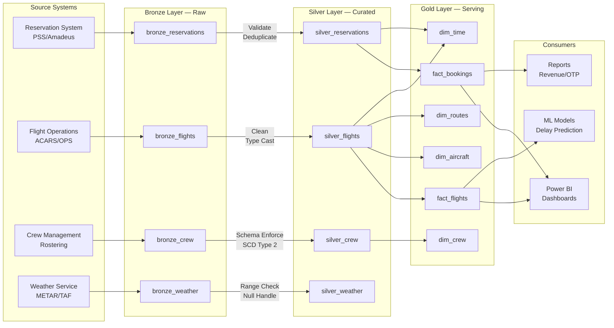
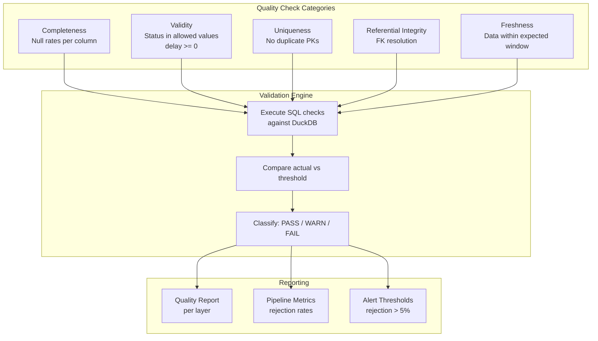
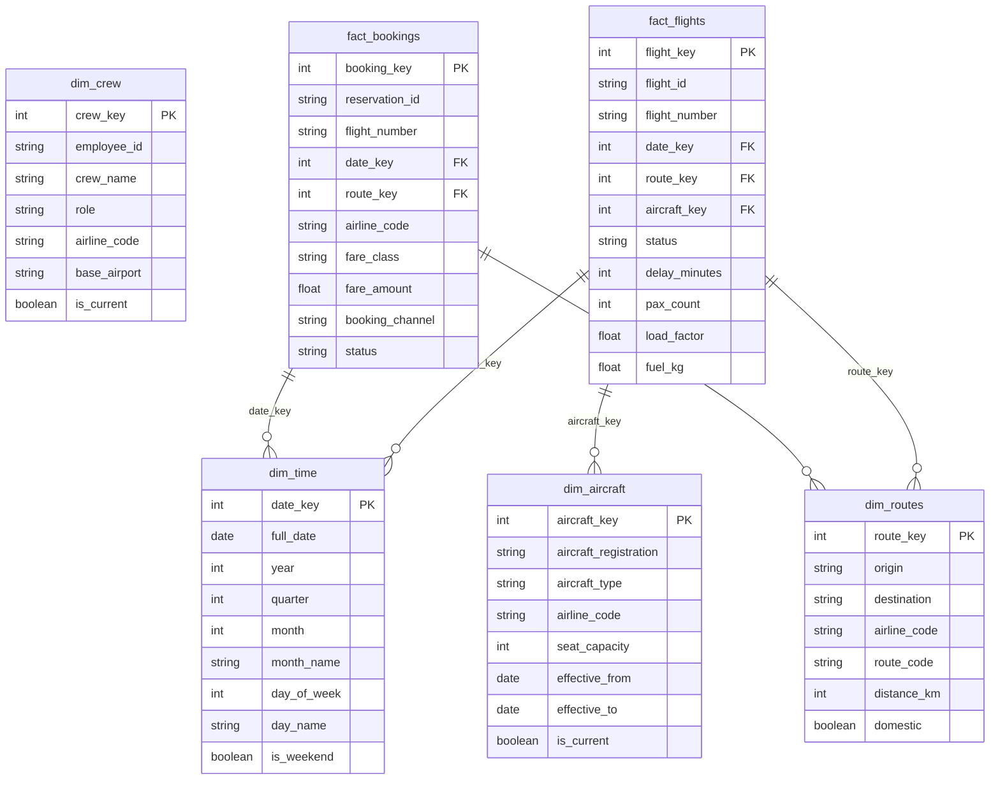

# Aviation Data Platform — Medallion Architecture

A fully working local data platform that simulates an airline's data engineering backbone. Ingests synthetic Vietnamese aviation data through a **medallion architecture** (Bronze/Silver/Gold) using DuckDB as the local analytical engine, with Pydantic schema enforcement, automated data quality checks, and structured observability.

## Why This Matters

Airlines operate dozens of interconnected source systems — reservation (PSS), flight operations (OPS), crew management, and weather services. A data engineering backbone must **integrate, validate, and model** this data for downstream analytics, revenue management, and operational decision-making.

This project demonstrates production-grade patterns that map directly to the Microsoft Data Platform stack used at scale:

| Local Component | Azure Equivalent | Purpose |
|---|---|---|
| DuckDB | Azure Synapse / Microsoft Fabric Lakehouse | Analytical query engine |
| Local JSON files | Azure Data Lake Storage Gen2 (ADLS) | Raw data landing zone |
| Python orchestrator | Azure Data Factory (ADF) / Fabric Pipelines | Pipeline orchestration |
| Pydantic models | Fabric schema enforcement / Data contracts | Schema validation |
| Quality framework | Great Expectations / Fabric Data Quality | Automated quality gates |
| structlog metrics | Azure Monitor / Log Analytics | Observability & alerting |
| CLI (`main.py`) | ADF triggers / Fabric notebooks | Execution interface |

## Tech Stack

- **Python 3.11+** — pipeline orchestration and data processing
- **DuckDB 1.1+** — embedded analytical database (OLAP)
- **Pydantic 2.5+** — schema validation and data contracts
- **structlog 24.1+** — structured logging for observability
- **Click 8.1+** — CLI interface
- **Faker 22.0+** — realistic synthetic data generation
- **tabulate 0.9+** — quality report formatting

## Architecture

### Medallion Architecture Flow



### Data Quality Framework



### Star Schema ERD



## Setup & Run

```bash
# 1. Install dependencies
pip install -r requirements.txt

# 2. Generate synthetic aviation data (1,000 flights + 3,000 bookings + crew + weather)
python main.py generate --records 1000

# 3. Run the full pipeline (bronze -> silver -> gold)
python main.py run --full

# 4. Run data quality checks
python main.py quality

# 5. Run a specific layer only
python main.py run --layer bronze
python main.py run --layer silver
python main.py run --layer gold

# 6. Backfill historical data (idempotent)
python main.py backfill --start-date 2024-01-01 --end-date 2024-01-31

# 7. Run tests
python -m pytest tests/ -v
```

### CLI Options

```
python main.py --help
python main.py generate --records 5000 --start-date 2024-06-01 --end-date 2024-06-30
python main.py run --full --log-level DEBUG
python main.py quality --layer silver
```

## Sample Output

### Pipeline Run

```
$ python main.py generate --records 1000 && python main.py run --full

Generated data:
  flights: 1,000 records
  reservations: 3,000 records
  crew: 1,000 records
  weather: 1,000 records

INFO  pipeline_stage_complete  stage=ingest_flights     layer=bronze  rows_in=1000  rows_out=1000  duration_ms=10974
INFO  pipeline_stage_complete  stage=ingest_reservations layer=bronze  rows_in=3000  rows_out=3000  duration_ms=800
INFO  pipeline_stage_complete  stage=process_flights    layer=silver  rows_in=1000  rows_out=976   rows_rejected=24   rejection_rate=0.024
INFO  pipeline_stage_complete  stage=process_reservations layer=silver rows_in=3000 rows_out=2913  rows_rejected=87   rejection_rate=0.029
INFO  gold_sql_executed  file=gold_dim_time.sql       table=dim_time       new_rows=31    total_rows=31
INFO  gold_sql_executed  file=gold_dim_aircraft.sql   table=dim_aircraft   new_rows=971   total_rows=971
INFO  gold_sql_executed  file=gold_fact_flights.sql   table=fact_flights   new_rows=1006  total_rows=1006
INFO  gold_sql_executed  file=gold_fact_bookings.sql  table=fact_bookings  new_rows=2913  total_rows=2913

Pipeline complete. Batch: batch-0bf4f1c2
  Gold totals: {'dim_time': 31, 'dim_aircraft': 971, 'dim_routes': 281, 'fact_flights': 1006, 'fact_bookings': 2913}
```

### Quality Report

```
================================================================================
  DATA QUALITY REPORT
================================================================================

  Total checks: 14
  Passed:       14
  Failed:       0
  Warnings:     0

  --- SILVER LAYER ---
  [PASS] silver_flights_valid_status         All flights have valid status values
  [PASS] silver_flights_positive_delay       No unrealistic negative delays
  [PASS] silver_reservations_positive_fare   All reservations have non-negative fares
  [PASS] silver_flights_null_rate_origin     Null rate 0.0 <= threshold 0.05
  [PASS] silver_flights_no_duplicates        No duplicate flight_id in silver

  --- GOLD LAYER ---
  [PASS] gold_fact_flights_referential_routes     All FK references valid
  [PASS] gold_fact_flights_referential_aircraft   All FK references valid
  [PASS] gold_fact_flights_referential_time       All FK references valid
  [PASS] gold_load_factor_range                   Load factor between 0 and 1.5

  VERDICT: PASSED — All quality checks passed
================================================================================
```

## Key Design Decisions

1. **Idempotent pipeline**: Silver uses `INSERT OR REPLACE` (upsert on PK), Gold uses `INSERT ... WHERE NOT IN`. Running twice produces no duplicates.

2. **Schema-as-code**: Pydantic models define and enforce the contract between layers. Invalid records are rejected with structured error logs.

3. **Bad data injection**: The generator intentionally produces ~2% invalid records (empty origins, negative fares, unknown aircraft types) to demonstrate the quality gates.

4. **Batch lineage**: Every bronze record carries `_batch_id`, linking it through silver to the pipeline_runs table for full lineage tracking.

5. **Observability-first**: Every stage logs `rows_in`, `rows_out`, `rows_rejected`, `duration_ms` to both structured logs and a `pipeline_runs` DuckDB table.

## Production Deployment Notes

To deploy this on Azure/Microsoft Fabric:

| Pattern | Local | Production |
|---|---|---|
| Storage | Local JSON files | ADLS Gen2 (Parquet/Delta) |
| Compute | DuckDB | Synapse Serverless / Fabric Lakehouse |
| Orchestration | Python CLI | ADF Pipelines / Fabric Notebooks |
| Schema enforcement | Pydantic | Delta Lake schema evolution + contracts |
| Quality gates | Custom SQL checks | Great Expectations / Fabric Data Quality |
| Observability | structlog + DuckDB | Azure Monitor + Log Analytics |
| Scheduling | Manual / cron | ADF triggers / Fabric schedules |
| Secrets | N/A | Azure Key Vault |
| CI/CD | pytest | Azure DevOps / GitHub Actions |

### Scale Considerations

- **140M+ records/day**: Replace row-by-row inserts with batch `COPY` / Spark DataFrames
- **Late-arriving data**: Watermark-based incremental processing (already demonstrated in Gold SQL)
- **SCD Type 2**: dim_aircraft and dim_crew include `effective_from`/`effective_to`/`is_current` columns
- **Multi-source reconciliation**: Bronze preserves raw data for audit; silver applies business rules
